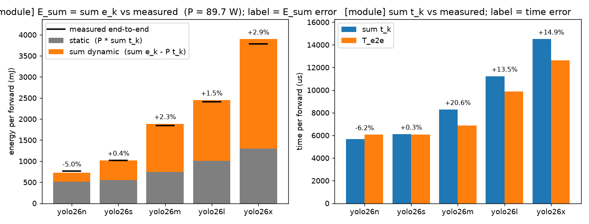
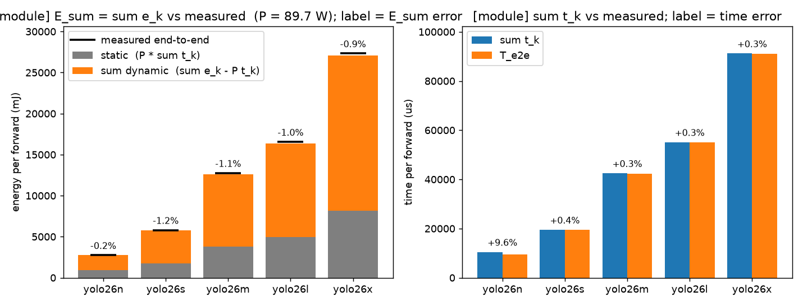
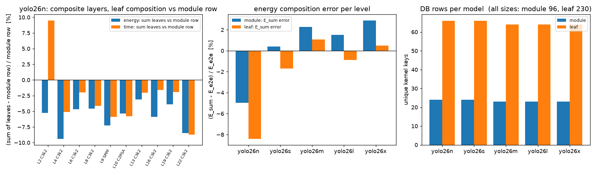

# Composing GPU inference energy from a per-kernel database: YOLO26 on an NVIDIA A40

Study report. Code: this repository (`ecalc/`, `scripts/`). Raw data behind every
number in this report is in [`docs/data/yolo26/`](./) (CSV exports of the SQLite database) and the full
per-layer report in [`docs/data/yolo26/estimate_report_full.md`](estimate_report_full.md).

## 1. Goal

Predict the energy of one model forward pass without measuring the model, by looking up its building blocks in a
database. The energy model is

```
E_kernel = E_dyn(kernel) + P_static * t(kernel)          measured once per (kernel, input shape, GPU, clock, dtype)
E_model  = sum_k E_dyn(k) + P_static * sum_k t(k)
```

Each *kernel* is measured once in isolation. Its dynamic energy is what remains after subtracting the static power
(the power the GPU draws while awake but doing nothing) for the kernel's duration. A model is then the sum of its
kernels' dynamic energies plus static power for the model's duration. The first target is YOLO26 (Ultralytics 8.4,
NMS-free detection head), sizes n/s/m/l/x, and the question is whether the composed estimate matches a direct
end-to-end measurement.

## 2. What was built

### 2.1 Kernel definition and identity

A kernel is one top-level layer of the YOLO yaml graph: the 24 entries of `DetectionModel.model` (Conv, C3k2, SPPF,
C2PSA, `nn.Upsample`, Concat, Detect). Each layer is identified by a 16-hex-digit SHA-256 of a canonical JSON
signature made of

- the module structure: every submodule class in `named_modules()` order with a per-class attribute whitelist
  (Conv2d in/out channels, kernel, stride, padding, dilation, groups; Upsample scale/mode; MaxPool2d geometry;
  Concat dim; Detect nc/nl/reg_max/max_det/end2end/strides; Attention heads/dims; Bottleneck/PSABlock `add`),
  plus all parameter and buffer names and shapes;
- the input tensor specs (shape and dtype; a list for Concat and Detect).

Graph-position attributes (`i`, `f`, `type`, `np`) and per-shape caches (Detect anchors/strides/shape) are excluded,
so the same block at a different position or in a different model size hashes to the same key. Inputs can be
re-synthesised from the stored signature alone (`synthesize_inputs`), so any row can be re-measured without the
model that produced it. A consistency test confirmed synthesized and captured inputs give the same energy and time
within 10% on Conv, C3k2 and Detect (`tests/test_gpu_consistency.py`).

### 2.2 Capturing layers with their real inputs

`ecalc/capture.py` re-implements `BaseModel._predict_once` routing (`m.f == -1` -> previous output, int -> saved
output, list -> gathered outputs) under `torch.inference_mode()`, runs the model once un-recorded (warms cuDNN plans
and the Detect anchor cache), then records a clone of every layer's input on the second pass. The model is loaded
with `ultralytics.nn.tasks.load_checkpoint`, the NMS-free (end2end) head is selected before fusing Conv+BN
(`model.end2end = True; model.fuse()`), which is what `predict(nms=False)` runs. The fused Detect returns
`(1, 300, 6)`. Nothing goes through `YOLO.predict` (it adds letterboxing, dtype selection and CPU post-processing).

Note: in ultralytics 8.4.148, `load_checkpoint(fuse=True)` keeps the one-to-many head by default; the one-to-one
head must be selected explicitly. The one-to-many variant is available with `--one2many` and stored as `<name>-nms`.

A second, finer granularity (`--level leaf`: leaf modules plus the functional glue ops inside blocks, captured with
forward hooks and a `TorchFunctionMode` on the same captured inputs) was added afterwards; it is described and
evaluated in Section 4.6.

### 2.3 Measurement protocol (kernels and whole models, identical)

Same method as kareus (`tests/bayesian/common/hardware.py`): a `ZeusMonitor(gpu_indices=[0])` and
`zeus.profile.measure(target_function, zeus_monitor, measurement_duration, cooldown_duration, ...)`, which
warms up, calibrates the per-call time over 1000 calls, sleeps the cooldown, warms up again and then runs
`int(measurement_duration / iteration_duration)` back-to-back calls inside one Zeus energy window (NVML energy
counter, torch-synchronised). Settings used for the full run:

| parameter | value |
|---|---|
| measurement window | 5.0 s |
| cooldown before window | 3.0 s |
| warm-up / calibration calls | 50 / 1000 |
| repeats | 3 for the module-level and end-to-end rows (median-energy trial stored, std recorded); 1 for the leaf-level rows added later, after the 3-repeat rows showed a repeat-to-repeat energy CV of 0.4 % median / 2.1 % max |
| calls per window | 2 406 to 470 795 (median 14 813) |
| per-kernel wall cost | about 27 s; 96 kernels in 40.9 min |

A background thread samples SM/memory clock, power and P-state every 50 ms; the summary over the Zeus window is
stored with each row, and rows are flagged when the SM clock dipped below 95% of its maximum or the temperature rose
more than 5 C. The end-to-end forward of each model was measured with exactly the same call.

Dynamic energy is **not** stored. It is derived at estimate time as `e_k - P_static * t_k`, so the static-power
definition can be changed without re-measuring anything.

### 2.4 Static power

Three definitions are stored in the `static_power` table; `active_idle` is the one used by default.

| method | A40 value | how |
|---|---|---|
| `active_idle` | **89.7 W** (20 cycles, std 1.2 W) | 2 s of full-model forwards, `torch.cuda.synchronize()`, wait 1 s, then a 1 s Zeus window. Only cycles that end at P0 with SM clock >= 95% of max are accepted (20/20 were). |
| `post_burst` | 100.4 W (std 17 W, max 156 W) | same but a 0.2 s window opened immediately after the burst; includes the decaying transient. |
| `p8_idle` | 23.4 W | raw NVML energy counter, three 10 s windows, taken in a process that holds no CUDA context so the GPU actually reaches P8 / 210 MHz. |

Why the settle delay: a 5 s power trace after a burst ([`docs/data/yolo26/decay_A40.csv`](decay_A40.csv)) shows the GPU stays at P0 /
1740 MHz for the whole trace while the process holds its CUDA context, but the reported power decays from ~110 W
to a plateau of ~80-88 W over about 1 s. Reading immediately after the burst therefore mixes the transient in. The
plateau itself depends on temperature: 84.8 W on a cool GPU in a smoke run, 89.7 W after 40 minutes of measuring.

### 2.5 Database

SQLite (`data/ecalc.sqlite`, WAL, one commit per kernel so runs are resumable):

- `kernel_energy` PK `(kernel_key, gpu_name, freq_label, dtype)`: energy, time, power, iterations, std over
  repeats, optional profiler GPU-active time, clock summary, temperatures, protocol parameters, TF32 flags,
  torch / ultralytics / zeus / driver versions, notes.
- `static_power` PK `(gpu_name, freq_label, method)`.
- `model_runs` PK `(model_name, gpu_name, freq_label, dtype, batch, imgsz)`: end-to-end ground truth.
- `model_kernels` PK `(model_name, dtype, batch, imgsz, level, layer_idx)`: the composition of each model at each
  granularity (`level` = `module` or `leaf`; at leaf level `layer_idx` is the execution index and
  `parent_layer_idx`/`path` locate the kernel inside its top-level layer), so an estimate is a `LEFT JOIN` of this
  table onto `kernel_energy`; misses show up as NULL. Kernel keys are level-agnostic, so both compositions share
  one `kernel_energy` table.

`freq_label` is `"default"` throughout because SM clock locking needs root on this host; the sampled clocks are
stored instead. The schema is ready for a frequency sweep once `nvidia-smi -lgc` is permitted.

### 2.6 Estimator

For a model with layers `k` (all 24 found in the DB for all five sizes):

```
E_dyn(k)      = e_k - P * t_k
E_sum         = sum_k E_dyn(k) + P * sum_k t_k     = sum_k e_k          (independent of P)
E_hyb         = sum_k E_dyn(k) + P * T_e2e                              (uses the measured model time)
```

`E_sum` is the pure database prediction. `E_hyb` checks the decomposition itself: if the static/dynamic split is
right, replacing the summed kernel times by the true model time must land on the measured energy.

## 3. Setup

| item | value |
|---|---|
| GPU | NVIDIA A40, 300 W cap, max SM clock 1740 MHz, driver 595.71.05 |
| software | Python 3.12 (uv), torch 2.14.0+cu130, ultralytics 8.4.148, zeus 0.16.0, nvidia-ml-py 13.610 |
| precision | fp32 with TF32 allowed for conv/matmul (Ampere default; recorded per row; `--strict-fp32` available) |
| input | batch 1 (Sections 4.1-4.4) and batch 8 (Section 4.5), 3x640x640, seeded `torch.randn`, `cudnn.benchmark = False` |
| models | yolo26n/s/m/l/x official weights (`ultralytics/assets` v8.4.0), fused, NMS-free head |
| GPU persistence mode | **off** (needs root on this host); every row carries the note `no_persistence_mode` |

The persistence-mode point matters less than expected: while a process holds its CUDA context the A40 never leaves
P0, and every measurement is done inside one process. It would matter for the P8 floor and for clock ramp-up
between processes. The scripts refuse to measure without it unless `--allow-no-persistence` is passed, which is how
this run was done.

## 4. Results

### 4.1 Kernel database

120 layer instances across the five models collapse to **96 unique kernels**; 18 keys are shared by two or three
models. yolo26m and yolo26l have the same width, so all their Conv, Concat, Upsample, SPPF and Detect layers share
keys (their C3k2 blocks differ in depth). yolo26s shares three kernels with m/l (SPPF, Upsample, one Conv) and one
with n. Every kernel row has a relative energy std across the 3 repeats of 0.7% (median) to 2.1% (max).

### 4.2 End-to-end measurements (ground truth)

| model | energy / forward | time / forward | mean power | GPU-active time (profiler) | GPU-active share |
|---|---|---|---|---|---|
| yolo26n | 765 mJ | 6.06 ms | 126 W | 1.92 ms | 32% |
| yolo26s | 1018 mJ | 6.08 ms | 167 W | 3.05 ms | 50% |
| yolo26m | 1847 mJ | 6.87 ms | 269 W | 5.96 ms | 87% |
| yolo26l | 2414 mJ | 9.89 ms | 244 W | 7.49 ms | 76% |
| yolo26x | 3788 mJ | 12.63 ms | 300 W | 12.15 ms | 96% |

Batch-1 eager PyTorch is launch-bound for the small sizes: yolo26n keeps the GPU busy only a third of the time and
its power is mostly the static floor. yolo26x is at the 300 W power cap for the whole forward.

### 4.3 Composed estimates vs. measurement (static = `active_idle`, 89.7 W)

| model | E_e2e | Σ e_k (E_sum) | error | Σ E_dyn | E_hyb | error | Σ t_k vs T_e2e |
|---|---|---|---|---|---|---|---|
| yolo26n | 765 mJ | 727 mJ | **-5.0%** | 217 mJ | 761 mJ | -0.5% | -6.2% |
| yolo26s | 1018 mJ | 1021 mJ | **+0.4%** | 474 mJ | 1020 mJ | +0.2% | +0.3% |
| yolo26m | 1847 mJ | 1889 mJ | **+2.3%** | 1146 mJ | 1763 mJ | -4.6% | +20.6% |
| yolo26l | 2414 mJ | 2450 mJ | **+1.5%** | 1444 mJ | 2331 mJ | -3.4% | +13.5% |
| yolo26x | 3788 mJ | 3897 mJ | **+2.9%** | 2596 mJ | 3729 mJ | -1.6% | +14.9% |



Left: stacked Σ E_dyn (orange) + P·Σ t_k (grey) against the measured end-to-end energy (black tick). Right: Σ t_k
against T_e2e.

Sensitivity of `E_hyb` to the static-power definition (`E_sum` does not change):

| model | P = 89.7 W (active_idle) | P = 23.4 W (p8_idle) |
|---|---|---|
| yolo26n | -0.5% | -3.8% |
| yolo26s | +0.2% | +0.3% |
| yolo26m | -4.6% | +0.5% |
| yolo26l | -3.4% | +0.2% |
| yolo26x | -1.6% | +1.7% |

### 4.4 Where the energy goes

Share of Σ e_k per layer type (number of layers of that type in brackets):

| model | Conv (7) | C3k2 (8) | SPPF (1) | C2PSA (1) | Concat (4) + Upsample (2) | Detect (1) |
|---|---|---|---|---|---|---|
| yolo26n | 12% | 54% | 3% | 7% | 1% | 22% |
| yolo26s | 18% | 53% | 2% | 6% | 3% | 18% |
| yolo26m | 26% | 53% | 1% | 3% | 3% | 14% |
| yolo26l | 20% | 62% | 1% | 4% | 1% | 11% |
| yolo26x | 23% | 60% | 1% | 3% | 1% | 12% |

The single most expensive layer is the Detect head for n/s/m (22% / 18% / 14%) and the first C3k2 block at
160x160 resolution for l/x (15% / 16%). Isolated per-layer power spans 108 W (small Concat, launch-bound) to
299 W (any heavy Conv, at the power cap); 13 kernels showed SM-clock dips below 95% of max, all of them at
295-300 W.

### 4.5 Batch-size sensitivity: batch 8

The whole pipeline was repeated at batch 8 (`BATCH=8 SKIP_STATIC=1 scripts/run_all.sh`). The batch
dimension is part of the kernel signature, so this added 96 new kernel rows (49.7 min, none shared with batch 1)
and five new `model_runs` rows; the static-power rows from Section 2.4 were reused unchanged. Everything else
(protocol, 3 repeats, 5 s windows, profiler pass after the Zeus measurements) is identical to the batch-1 run.
Data: [`docs/data/yolo26/per_layer_estimate_batch8.csv`](per_layer_estimate_batch8.csv),
[`docs/data/yolo26/estimate_report_full_batch8.md`](estimate_report_full_batch8.md); rows with `batch = 8` in
`model_runs.csv` / `model_kernels.csv`.

**Ground truth and pure database prediction (Σ e_k), batch 1 vs batch 8**

| model | batch | E_e2e / forward | T_e2e / forward | mean power | GPU-active share | Σ t_k vs T_e2e | **Σ e_k vs E_e2e** |
|---|---|---|---|---|---|---|---|
| yolo26n | 1 | 765 mJ | 6.06 ms | 126 W | 32% | -6.2% | -5.0% |
| | 8 | 2749 mJ | 9.56 ms | 288 W | 98% | +9.6% | **-0.2%** |
| yolo26s | 1 | 1018 mJ | 6.08 ms | 167 W | 50% | +0.3% | +0.4% |
| | 8 | 5806 mJ | 19.44 ms | 299 W | 99% | +0.4% | **-1.2%** |
| yolo26m | 1 | 1847 mJ | 6.87 ms | 269 W | 87% | +20.6% | +2.3% |
| | 8 | 12749 mJ | 42.38 ms | 301 W | 99% | +0.3% | **-1.1%** |
| yolo26l | 1 | 2414 mJ | 9.89 ms | 244 W | 76% | +13.5% | +1.5% |
| | 8 | 16548 mJ | 54.99 ms | 301 W | 99% | +0.3% | **-1.0%** |
| yolo26x | 1 | 3788 mJ | 12.63 ms | 300 W | 96% | +14.9% | +2.9% |
| | 8 | 27326 mJ | 90.98 ms | 300 W | 99% | +0.3% | **-0.9%** |
| mean abs error | 1 | | | | | 11.1% | 2.4% |
| | 8 | | | | | 2.2% | 0.9% |



**E_hyb error under each static-power definition** (mean absolute / worst case over the five sizes):

| batch | `post_burst` 100.4 W | `active_idle` 89.7 W | `p8_idle` 23.4 W |
|---|---|---|---|
| 1 | 2.3% / 5.4% | 2.1% / 4.6% | 1.3% / 3.8% |
| 8 | 1.6% / 3.6% | 1.6% / 3.2% | 1.1% / 1.2% |

Per model at batch 8 the three definitions agree within 0.3 percentage points for s/m/l/x (all about -1.0 to
-1.3%); only yolo26n spreads (-3.6% post_burst, -3.2% active_idle, -1.0% p8).

**Energy per image and static share** (static = active_idle, share of Σ e_k):

| model | batch 1 | batch 8 | change | static share b1 -> b8 |
|---|---|---|---|---|
| yolo26n | 765 mJ/img | 344 mJ/img | -55% | 70% -> 34% |
| yolo26s | 1018 mJ/img | 726 mJ/img | -29% | 54% -> 31% |
| yolo26m | 1847 mJ/img | 1594 mJ/img | -14% | 39% -> 30% |
| yolo26l | 2414 mJ/img | 2069 mJ/img | -14% | 41% -> 30% |
| yolo26x | 3788 mJ/img | 3416 mJ/img | -10% | 33% -> 30% |

What changes between batch 1 and batch 8:

- **Composition gets more accurate.** At batch 8 every model is GPU-bound (98-99% GPU-active, pinned at the 300 W
  cap) and the plain sum of kernel energies is within 1.2% of the measurement for all five sizes. Time now composes
  too: Σ t_k matches T_e2e within 0.4% for s/m/l/x, because there is no CPU-launch/GPU overlap left to lose.
- **yolo26n at batch 8 is the last partially launch-bound case.** Its Σ t_k still overshoots by 9.6% (the light
  layers are still CPU-bound at 8x3x640x640), while its energy is within 0.2%.
- **The static-power definition stops mattering** once Σ t_k ≈ T_e2e, because the `P · (Σ t_k - T_e2e)` term in
  `E_hyb` vanishes. The remaining -1% bias at batch 8 is identical for every P, so it is a property of the kernel
  rows (isolated power-capped layers run marginally slower and hotter than inside the model), not of the static
  power. The batch-1 ranking (`active_idle` slightly better and far more repeatable than `post_burst`) still holds.
- **Static energy is what batching removes.** The static share converges to ~30% for every size at batch 8; at
  batch 1 the small models were mostly paying for an awake but idle GPU (70% for yolo26n). Per-image energy drops
  by 55% for n but only 10% for x, which was already at the power cap at batch 1.

### 4.6 Kernel granularity: leaf level vs. module level

Everything above uses one kernel per top-level Ultralytics layer (`level=module`). A second granularity,
`level=leaf`, was added to test whether finer kernels give the same accuracy and what they cost in database rows.
At leaf level a kernel is

- a leaf module: Ultralytics `Conv`/`DWConv` (fused Conv2d + activation, what actually runs after `fuse()`),
  `nn.MaxPool2d`, `nn.Upsample`, `Concat`, `Attention` (kept as one kernel; its qkv/softmax/matmul math has no
  module boundary), and `Detect` (kept whole in this iteration, so the leaf composition is mixed-granularity), or
- a functional glue op between leaves: `torch.cat`, `Tensor.chunk`, `Tensor.split`, residual `add`
  (C3k2: chunk + cat; C3k: cat; Bottleneck: add; SPPF: cat of 4 + add; C2PSA: split + cat; PSABlock: 2 adds).

Capture re-runs every top-level layer on its captured inputs with forward hooks on the leaf submodules and a
`TorchFunctionMode` that records the ops executed outside any leaf (a depth counter suppresses everything inside
`Attention`/`Detect`, so no op is counted twice). Any op outside the whitelist aborts the capture, so the
composition is complete by construction. Kernel keys are level-agnostic: a top-level `Conv` has the same key at
both levels and its row is shared. Leaf rows were measured with `repeats=1` (see 2.3): across the 192 earlier
three-repeat rows the repeat-to-repeat energy CV was 0.4 % median, 2.1 % max, so a second trial adds nothing at
the 1-5 % level compared here.

**Size of the two compositions (batch 1).** `instances` = kernel calls per forward, `keys` = unique rows needed.

| model | module instances | module keys | leaf instances (modules + ops) | leaf keys (modules + ops) | leaf keys already in module DB |
|---|---|---|---|---|---|
| yolo26n | 24 | 24 | 126 (84 + 42) | 66 (45 + 21) | 14 |
| yolo26s | 24 | 24 | 126 (84 + 42) | 66 (45 + 21) | 14 |
| yolo26m | 24 | 23 | 140 (94 + 46) | 64 (43 + 21) | 13 |
| yolo26l | 24 | 23 | 215 (146 + 69) | 64 (43 + 21) | 13 |
| yolo26x | 24 | 23 | 215 (146 + 69) | 64 (43 + 21) | 13 |
| all five | 120 | **96** (18 shared) | 822 | **230** (62 shared) | |

Adding sizes in the order n, s, m, l, x costs 66, 58, 36, 6, 64 new leaf keys (module level: 24, 23, 18, 8, 23).
yolo26m and yolo26l share every leaf module except the C3k2 `cv2` convs, whose input width is (2 + n)·c, and the
C3k2 `cat` ops (3 vs 4 tensors), so l adds only 6 keys over m. Measuring the 179 leaf rows not already in the DB
took 24 min (7.0 + 17.2 min, ~8 s per row with one repeat) against 41 min for the 96 module rows with three
repeats. **For this model family the leaf DB is 2.4x larger than the module DB**, because a YOLO26 size has
~45 distinct Conv shapes but only ~23 distinct layers; the finer level does not shrink the database, it makes
the rows transferable to any architecture built from the same Conv shapes.

**Whole-model accuracy at both levels (batch 1, P = 89.7 W).**

| model | level | kernels hit | Σ e_k (E_sum) | error | E_hyb | error | Σ t_k vs T_e2e |
|---|---|---|---|---|---|---|---|
| yolo26n | module | 24/24 | 727 mJ | -5.0% | 761 mJ | -0.5% | -6.2% |
| yolo26n | leaf | 126/126 | 700 mJ | **-8.4%** | 746 mJ | -2.4% | -8.5% |
| yolo26s | module | 24/24 | 1021 mJ | +0.4% | 1020 mJ | +0.2% | +0.3% |
| yolo26s | leaf | 126/126 | 1000 mJ | **-1.7%** | 999 mJ | -1.8% | +0.1% |
| yolo26m | module | 24/24 | 1889 mJ | +2.3% | 1763 mJ | -4.6% | +20.6% |
| yolo26m | leaf | 140/140 | 1867 mJ | **+1.1%** | 1710 mJ | -7.4% | +25.5% |
| yolo26l | module | 24/24 | 2450 mJ | +1.5% | 2331 mJ | -3.4% | +13.5% |
| yolo26l | leaf | 215/215 | 2392 mJ | **-0.9%** | 2232 mJ | -7.5% | +18.1% |
| yolo26x | module | 24/24 | 3897 mJ | +2.9% | 3729 mJ | -1.6% | +14.9% |
| yolo26x | leaf | 215/215 | 3806 mJ | **+0.5%** | 3594 mJ | -5.1% | +18.7% |

The leaf composition reaches the same accuracy class: |E_sum error| ≤ 1.7 % for s/m/l/x (module level: ≤ 2.9 %)
and -8.4 % for the launch-bound yolo26n (module level: -5.0 %). Leaf sums are consistently *lower* than module
sums (0.96-0.99x), which improves the m/l/x estimates that the module level overshoots and worsens n/s. The time
sum overshoots more than at module level (+18 to +26 % for m/l/x), so `E_hyb`, which subtracts P·Σt_k and adds
P·T_e2e, drifts to -5 to -7.5 % for m/l/x: at leaf level `E_sum` is the estimator to use.



Left: per composite layer of yolo26n, deviation of the sum of its leaf rows from the module-level row (energy and
time). Middle: `E_sum` error per size at both levels. Right: unique kernel rows per size.

**Per-block validation.** Summing the leaf rows of each composite layer and comparing with the module-level row
of the same layer isolates what the finer composition misses, before it is averaged into a whole-model number
(full tables for all sizes: [compare_levels_b1.md](compare_levels_b1.md)):

| layer (yolo26n) | leaves + ops | E_leaf / E_mod | t_leaf / t_mod | GPU-time ratio |
|---|---|---|---|---|
| L2 C3k2 160x160 | 4 + 3 | 0.948 | 1.095 | 0.991 |
| L4 C3k2 80x80 | 4 + 3 | 0.906 | 0.949 | 0.921 |
| L6 C3k2 40x40 | 9 + 5 | 0.953 | 0.980 | 0.992 |
| L8 C3k2 20x20 | 9 + 5 | 0.954 | 0.959 | 0.996 |
| L9 SPPF | 5 + 2 | 0.928 | 0.941 | 0.990 |
| L10 C2PSA | 5 + 4 | 0.946 | 0.942 | 0.963 |
| L13 / L16 / L19 C3k2 | 9 + 5 | 0.969 / 0.941 / 0.961 | 0.979 / 0.984 / 0.980 | 0.970 / 0.960 / 0.987 |
| L22 C3k2 (attn) | 7 + 5 | 0.915 | 0.913 | 0.946 |
| whole model | 84 + 42 | 0.964 | 0.976 | 0.984 |

Two effects show up:

1. **Energy: the sum of isolated leaves is below the block measured as a unit** in 45 of the 50 composite blocks
   (energy ratio per size: n 0.91-0.97, s 0.91-1.04, m 0.89-1.07, l 0.89-1.01, x 0.89-0.98; the five exceptions
   are GPU-heavy 80x80/160x160 C3k2 blocks whose leaf *time* sums overshoot most, so they carry extra P·t). The
   profiler GPU-active time sums are also 1-8 % lower for yolo26n, so the deficit is a GPU-side effect, not a
   launch-gap artefact: a leaf measured alone re-reads the same input tensor tens of thousands of times from a
   warm L2, whereas inside the block the activations stream between different kernels. The module-level row
   already contains that inter-kernel traffic; the leaf level loses it. It is a systematic bias, not noise, and
   it is what a per-block overhead term would have to model.
2. **Time: launch/GPU overlap is lost twice.** For the launch-bound small-input blocks the leaf time sum is close
   to the module row (yolo26n: 0.91-1.10). For the GPU-heavy 80x80/160x160 C3k2 blocks of the wide sizes the
   leaf time sum overshoots by up to 31 % (yolo26m L4, L16: 1.31, 1.32) while the GPU-time ratio stays at 1.00:
   inside the block the CPU launches the small `add`/`cat`/1x1 convs while the big 3x3 conv still runs, so their
   launch cost is hidden; in isolation each leaf's loop time is max(launch, GPU) and nothing hides it.

**Where the leaf-level energy goes (batch 1, share of Σ e_k).**

| kernel type | yolo26n | yolo26x | mean power (n / x) | note |
|---|---|---|---|---|
| Conv (fused conv + act) | 60.9 % (72 calls) | 77.2 % (133 calls) | 129 / 243 W | |
| Detect (whole head) | 22.5 % | 11.9 % | 119 / 268 W | 1.3-1.7 ms per call |
| Attention | 8.0 % (2) | 2.9 % (3) | 107 / 132 W | 260-280 µs each, launch-bound |
| op:cat | 2.9 % (15) | 3.9 % (24) | 120 / 183 W | real copy kernels |
| op:add | 2.5 % (18) | 2.0 % (36) | 107 / 154 W | |
| Concat / Upsample / MaxPool2d | 2.6 % | 1.9 % | | |
| op:chunk, op:split | 0.6 % (9) | 0.1 % (9) | 92-97 W | view ops: 4.4-5.7 µs, zero profiler GPU time, power ≈ P |

The `chunk`/`split` rows confirm the static-power definition from the kernel side: a call that launches no CUDA
kernel measures 92-97 W, i.e. P·t within a few watts of the 89.7 W `active_idle` value.

**Batch 8.** The same leaf pass at batch 8 (179 new rows, 25 min) separates the two effects. In the GPU-bound
regime the leaf time sums land within 2 % of T_e2e for every size, exactly like the module level, so nothing is
left of the launch-overlap overshoot; the energy sums are nevertheless 3.6-5.4 % low, against within 1.2 % at
module level:

| model | level | Σ t_k vs T_e2e | Σ e_k (E_sum) | error | E_hyb error | per-block E ratio (composite layers) | GPU-time ratio (whole model) |
|---|---|---|---|---|---|---|---|
| yolo26n | module | +9.6% | 2743 mJ | -0.2% | -3.2% | | |
| yolo26n | leaf | +9.2% | 2649 mJ | **-3.6%** | -6.5% | 0.89-1.01 | 0.970 |
| yolo26s | module | +0.4% | 5738 mJ | -1.2% | -1.3% | | |
| yolo26s | leaf | +0.2% | 5513 mJ | **-5.0%** | -5.1% | 0.90-1.00 | 0.981 |
| yolo26m | module | +0.3% | 12608 mJ | -1.1% | -1.2% | | |
| yolo26m | leaf | -1.6% | 12057 mJ | **-5.4%** | -4.9% | 0.91-1.00 | 0.973 |
| yolo26l | module | +0.3% | 16376 mJ | -1.0% | -1.1% | | |
| yolo26l | leaf | -0.8% | 15702 mJ | **-5.1%** | -4.9% | 0.92-1.01 | 0.981 |
| yolo26x | module | +0.3% | 27087 mJ | -0.9% | -1.0% | | |
| yolo26x | leaf | -0.9% | 26295 mJ | **-3.8%** | -3.5% | 0.95-0.98 | 0.983 |

The whole-model profiler GPU-active time of the leaf rows sums to 97-98 % of the module-level value at batch 8
while the wall time sums agree with T_e2e: a leaf executed alone on the same input for 10^4-10^5 iterations runs
slightly faster and at lower power than inside the block, because its input never leaves the L2 cache
(A40: 6 MB) and no other kernel's traffic interferes. At batch 1 this deficit was partly hidden by the
launch-overlap overshoot, which carries extra P·t; at batch 8 it is the whole error. It is reproducible (the
same blocks are low at both batch sizes, e.g. the attention C3k2 L22 is at 0.89-0.93 at batch 1 and 0.89-0.98 at
batch 8) and therefore correctable, but the correction is a per-block quantity that the module level measures directly. Full batch-8
tables: [compare_levels_b8.md](compare_levels_b8.md), figure
[compare_levels_yolo26_a40_batch8.png](../../figures/compare_levels_yolo26_a40_batch8.png).

## 5. Findings

1. **Energy composes.** The plain sum of isolated kernel energies predicts the measured model energy within 5% for
   all five sizes at batch 1 (within 3% for four of them) and within 1.2% at batch 8, from a database that needs no
   knowledge of the model beyond its layer list. This holds across a 36x range in energy (765 mJ to 27.3 J) and
   across launch-bound (batch-1 n, s) and power-capped (x, everything at batch 8) regimes.

2. **Time composes only at the GPU level.** The sum of isolated wall times overshoots the model time by 13-21% for
   m/l/x. The profiler's GPU-active time, however, sums to the end-to-end GPU-active time within 0.3% for every size
   (1898 vs 1918 us for n, 12152 vs 12148 us for x). Inside the model, CPU launch overhead of light layers overlaps
   with GPU execution of heavy ones; in isolation each layer's wall time is `max(cpu, gpu)` and that overlap is lost.
   Energy is much less affected because the extra time is spent near the static floor. At batch 8 the overlap
   disappears and wall time composes within 0.4% for s/m/l/x (Section 4.5).

3. **The static/dynamic split is consistent.** Replacing Σ t_k with the true T_e2e (`E_hyb`) lands within 0.5% for n
   and within 5% for all sizes with the 89.7 W active-idle power. The residual for m/l suggests the effective floor
   during dense, power-capped work is somewhat below 89.7 W (with P = 23 W the hybrid error becomes +0.5% / +0.2%),
   which is plausible: at the power cap the GPU lowers clocks, so "static" leakage is not a constant.

4. **Static power dominates small models.** At batch 1, 70% of yolo26n's energy (509 of 727 mJ) is static; for
   yolo26x it is 33%. Any batch-1 latency win translates almost 1:1 into energy for the small sizes.

5. **Static power is a measured, temperature-dependent quantity.** P8 idle (23 W) is not a usable floor for
   inference; the awake-at-P0 floor is 85-90 W on this A40 and rises a few watts as the card heats up.

6. **Finer granularity keeps the accuracy class but not the database size, and introduces a known bias.**
   Composing from leaf modules and glue ops (Section 4.6) predicts the batch-1 energy within 1.7% for s/m/l/x and
   -8.4% for n; at batch 8 it is 3.6-5.4% low for every size (module level: within 1.2%). The bias is per block
   and reproducible: isolated leaves run on cache-resident inputs and miss the inter-kernel memory traffic that a
   whole block pays, 3-9% of the block energy. Time composes at leaf level as well as at module level (within 2%
   at batch 8). The leaf DB needs 230 rows for the five sizes against 96 at module level, because YOLO26 has more
   distinct Conv shapes than distinct layers; the gain is transferability of the rows, not compactness.

7. **Tooling pitfalls found on the way.** (a) `torch.profiler`, once used in a process, slows every later CUDA
   launch by ~30%; the profiler pass is therefore run after all Zeus measurements. (b) A Zeus window syncs with
   torch, which creates a CUDA context and keeps the GPU at P0, so the P8 floor must be read from the raw NVML
   counter before any CUDA call. (c) The end-to-end energy of the same model drifted 10% between a cold and a warm
   GPU in smoke runs (714 vs 787 mJ for yolo26n); the full run interleaves a 3 s cooldown and takes medians, and the
   e2e rows show 0.1-0.9% std across repeats.

## 7. Reproduction

```
uv sync
sudo nvidia-smi -i 0 -pm 1                     # once; or ALLOW_NO_PM=1 for a flagged run
uv run pytest tests -m "not gpu"               # 25 CPU tests (signatures, leaf capture, DB migration)
uv run pytest tests -m gpu                     # 4 GPU consistency tests
scripts/run_all.sh                             # static -> 96 kernels (~41 min, 3 repeats) -> e2e -> reports -> CSV
BATCH=8 SKIP_STATIC=1 scripts/run_all.sh       # batch-8 pass (~50 min), reuses the static-power rows
LEVEL=leaf SKIP_STATIC=1 SKIP_E2E=1 scripts/run_all.sh          # leaf DB (179 new rows, ~24 min) + level comparison
LEVEL=leaf BATCH=8 SKIP_STATIC=1 SKIP_E2E=1 scripts/run_all.sh  # same at batch 8
uv run python scripts/inspect_model.py --models all --level leaf   # leaf counts and reuse, no GPU needed
uv run python scripts/estimate_model.py --models all --batch 8 --static-method post_burst
uv run python scripts/estimate_model.py --models all --level leaf --compare-levels --plot
```

Files produced: `data/ecalc.sqlite`, `data/export/*.csv`, `results/reports/estimate_*.md|csv`,
`results/reports/compare_levels_*.md|csv`, `results/plots/*.png`, `results/static_power/decay_A40.csv`,
`results/logs/*.log`.


## Notes

YOLO26 pipeline
```
flowchart TB
    X([input 1x3x640x640]) --> L0
    subgraph Backbone
        L0["0 Conv 3→16 k3 s2<br/>→1x16x320x320 · 2.8%"] --> L1["1 Conv 16→32 k3 s2<br/>→1x32x160x160 · 2.0%"]
        L1 --> L2["2 C3k2 32→16<br/>→1x64x160x160 · 6.0%"]
        L2 --> L3["3 Conv 64→64 k3 s2<br/>→1x64x80x80 · 2.8%"]
        L3 --> L4["4 C3k2 64→32<br/>→1x128x80x80 · 3.9%"]
        L4 --> L5["5 Conv 128→128 k3 s2<br/>→1x128x40x40 · 1.6%"]
        L5 --> L6["6 C3k2 128→32<br/>→1x128x40x40 · 6.7%"]
        L6 --> L7["7 Conv 128→256 k3 s2<br/>→1x256x20x20 · 1.2%"]
        L7 --> L8["8 C3k2 256→64<br/>→1x256x20x20 · 7.1%"]
        L8 --> L9["9 SPPF 256→256<br/>1x256x20x20 · 2.6%"]
        L9 --> L10["10 C2PSA 256→128<br/>1x256x20x20 · 7.3%"]
    end
    subgraph Neck_top_down
        L10 --> L11["11 Upsample x2<br/>→1x256x40x40 · 0.2%"]
        L11 --> L12["12 Concat<br/>→1x384x40x40 · 0.2%"]
        L6 -. skip .-> L12
        L12 --> L13["13 C3k2 384→32<br/>→1x128x40x40 · 6.7%"]
        L13 --> L14["14 Upsample x2<br/>→1x128x80x80 · 0.3%"]
        L14 --> L15["15 Concat<br/>→1x256x80x80 · 0.8%"]
        L4 -. skip .-> L15
        L15 --> L16["16 C3k2 256→16<br/>→1x64x80x80 · 7.7%"]
    end
    subgraph Neck_bottom_up
        L16 --> L17["17 Conv 64→64 k3 s2<br/>→1x64x40x40 · 1.0%"]
        L17 --> L18["18 Concat<br/>→1x192x40x40 · 0.2%"]
        L13 -. skip .-> L18
        L18 --> L19["19 C3k2 192→32<br/>→1x128x40x40 · 6.6%"]
        L19 --> L20["20 Conv 128→128 k3 s2<br/>→1x128x20x20 · 0.9%"]
        L20 --> L21["21 Concat<br/>→1x384x20x20 · 0.2%"]
        L10 -. skip .-> L21
        L21 --> L22["22 C3k2 384→128<br/>→1x256x20x20 · 9.6%"]
    end
    L16 == P3 80x80 ==> L23
    L19 == P4 40x40 ==> L23
    L22 == P5 20x20 ==> L23
    L23["23 Detect nc=80, NMS-free<br/>→1x300x6 · 21.7%"] --> Y([detections])
```

How to read it:

- Node label = layer index, module type and channels, output shape, and that kernel's share of the summed energy for yolo26n (static + dynamic, 727 mJ total).
- Solid arrows are the sequential path (f = -1); dotted "skip" arrows are the saved outputs that Concat gathers (f = [-1, 6], [-1, 4], [-1, 13], [-1, 10]), and the three thick arrows are the P3/P4/P5 feature maps that Detect takes (f = [16, 19, 22]). Layers 4, 6, 10, 13, 16, 19, 22 are the ones the model keeps in its save list.
- Each node is exactly one row in kernel_energy, keyed by module structure + input shape. That is why layer 3 and layer 17 (both Conv 64→64 k3 s2) are different kernels: same module, different input (160×160 vs 80×80).

Energy by stage for yolo26n: backbone (0–10) ≈ 44%, neck (11–22) ≈ 34%, Detect head ≈ 22%. For the larger sizes the head's share drops (12% on x) and the first C3k2 at 160×160 becomes the single biggest block (15–16%).

For the other sizes only the channel widths change (n: 16/32/64/128/256; s: 32/64/128/256/512; m and l: 64/128/256/512/512 with deeper C3k2 in l; x: 96/192/384/768/768); the topology and Detect inputs are identical. If you want this as a rendered figure with per-layer energy bars in the report, ask in the main conversation and it can be generated from the model_kernels and kernel_energy tables and committed under docs/.

One problem: At the granularity chosen for this study (Ultralytics module = one top-level layer of the yaml graph), a C3k2, SPPF or C2PSA "kernel" is really a small sub-graph of PyTorch modules, and at the CUDA level each of those launches several GPU kernels.

C3k2 (layer 6)
```
flowchart TB
    X([1x128x40x40]) --> CV1["cv1 Conv 128→64 k1"]
    CV1 -- "split 2×c" --> A["a: 1x32x40x40"]
    CV1 --> B["b: 1x32x40x40"]
    subgraph m["m: ModuleList (n sub-blocks, C3k or Bottleneck)"]
        B --> S1["sub-block 1"]
        S1 --> S2["sub-block …"]
    end
    A --> CAT["Concat a, b, m₁, …"]
    B --> CAT
    S2 --> CAT
    CAT --> CV2["cv2 Conv (2+n)·c→128 k1"]
    CV2 --> Y([1x128x40x40])
```
Each sub-block is one of:
```
flowchart LR
    subgraph Bottleneck
        I1([c]) --> B1["Conv c→c k3"] --> B2["Conv c→c k3"] --> ADD1((+)) --> O1([c])
        I1 -. add=True .-> ADD1
    end
    subgraph C3k["C3k (a small C3 with k3 bottlenecks)"]
        I2([c]) --> C1["cv1 Conv k1"] --> BN["Bottleneck ×2<br/>(Conv k3 → Conv k3, +res)"] --> C3c["Concat"] --> C2["cv3 Conv k1"] --> O2([c])
        I2 --> Cs["cv2 Conv k1"] --> C3c
    end
```

SPPF (layer 9)
```
flowchart LR
    X([1x256x20x20]) --> CV1["cv1 Conv 256→128 k1"]
    CV1 --> P1["MaxPool2d k5 s1 p2"]
    P1 --> P2["MaxPool2d k5 s1 p2"]
    P2 --> P3["MaxPool2d k5 s1 p2"]
    CV1 --> CAT["Concat<br/>1x512x20x20"]
    P1 --> CAT
    P2 --> CAT
    P3 --> CAT
    CAT --> CV2["cv2 Conv 512→256 k1"]
    CV2 --> Y([1x256x20x20])
```

C2PSA
```
flowchart TB
    X([1x256x20x20]) --> CV1["cv1 Conv 256→256 k1"]
    CV1 -- "split c, c" --> A["a: 1x128x20x20"]
    CV1 --> B["b: 1x128x20x20"]
    subgraph m["m: Sequential of PSABlock (n blocks)"]
        B --> PSA1["PSABlock 1"] --> PSA2["PSABlock …"]
    end
    A --> CAT["Concat<br/>1x256x20x20"]
    PSA2 --> CAT
    CAT --> CV2["cv2 Conv 256→256 k1"]
    CV2 --> Y([1x256x20x20])
```
Inside one PSABlock (attributes captured: num_heads=2, head_dim=64, key_dim=32, add=True):
```
flowchart TB
    I([1x128x20x20]) --> QKV["attn.qkv Conv 128→(2·32+64)·2 k1"]
    QKV -- "split q,k,v per head" --> QK["q·kᵀ matmul<br/>scale 1/√32, softmax"]
    QK --> AV["attn·v matmul"]
    QKV --> PE["attn.pe depthwise Conv k3 on v"]
    AV --> SUM((+))
    PE --> SUM
    SUM --> PROJ["attn.proj Conv 128→128 k1"]
    PROJ --> R1((+))
    I -. residual .-> R1
    R1 --> F1["ffn Conv 128→2·128 k1"] --> F2["ffn Conv 2·128→128 k1"] --> R2((+))
    R1 -. residual .-> R2
    R2 --> O([1x128x20x20])
```